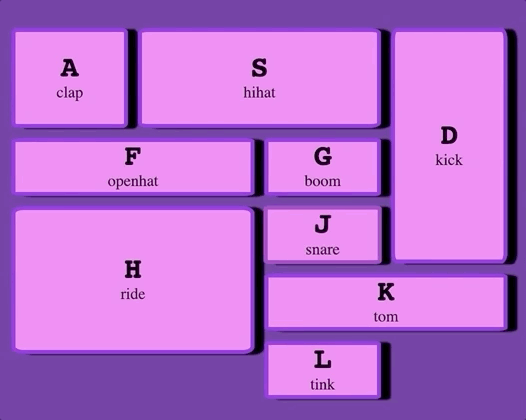

# js30-1-drumkit
An adapted version of the JS30 Drumkit https://github.com/wesbos/JavaScript30

Open up index.html in your browser of choice, press the letter on the keyboard corresponding with the  and get jammin'!

